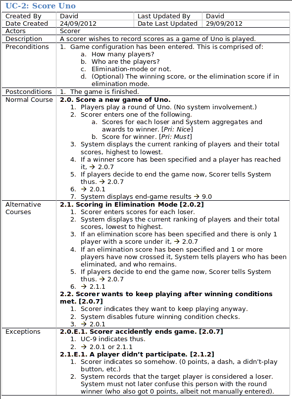
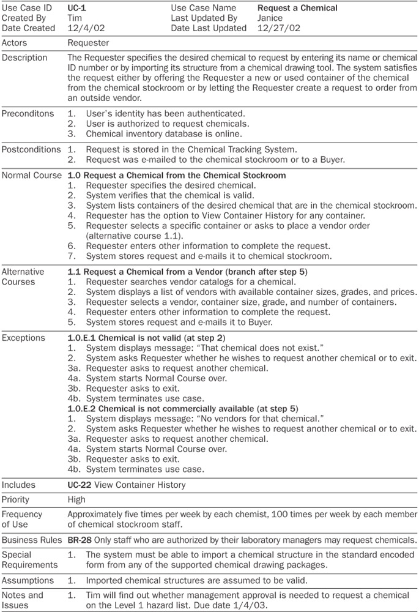

title: ShipReq
layout: true

<!--
.bottom-bar[
  {{title}}
]

NOTE TO SELF: To prepare demo,
* Build Docker images in release mode
* `bin/env dev up`
* https://local.shipreq.com
* Ensure user exists and can login
* Create req-code demo
-->

---
class: middle, center

PRODUCT SHOWCASE

---

# Agenda

 

1. What and why is ShipReq?

1. Roadmap

1. Features and Demo

---

# ShipReq is...
a cloud-based web platform for businesses to

* record
* maintain
* socialise

requirements.

---
name: requirements

# Requirements

Requirements are details that describe and communicate the
 {who, what, when, where, why, how} of a goal.
   

---
template: requirements

#### Computing:
* software development
* hardware development
* graphic design
* etc.

---
template: requirements

#### Manufacturing:
* cars
* furniture
* pace makers
* kettles
* etc.

---
template: requirements

#### Social alignment:
* governance
* contracts
* legal
* etc.

---

# Requirements Matter

Some stats from studies:
--

* Portland Business Journal: “Most analyses conclude that between 65 and 80% of IT projects fail to meet their
  objectives, and also run significantly late or cost far more than planned.”
--

* 2011: 78% of organizations reported that the “Business is usually or always out of sync with project requirements”
--

* 2010: 70% of organizations have suffered at least one project failure in the prior 12 months
--

* 2008: 60% of projects do not meet schedule, budget and quality goals
--

* 17% of IT projects run so badly that they threaten the very existence of a company

---

# Requirements Matter

Some stats from studies:

* It costs 10-70x more to fix a problem during the dev & testing phases, than during the requirements phase

--

* It costs 40-1000x more to fix a problem when an app is live, than during the requirements phase
--

* Rework often consumes 30-50% of total dev cost

--

* 70-85% of rework is caused by bad requirements

---

# Initial focus

ShipReq's initial focus is software development,

my primary expertise and strength.

---

# Current Industry State

--

* office, MS word & Excel, Google docs
--

* issue trackers, Jira
--

* post-it notes, Trello
--

* vendor product
--

* mental

---

# Problems

--

* ease of access
--

* ease of use
--

  * wrong solution fit
--

  * flexibility
--

  * UX
--

* data integrity
--

* doesn't scale
--

  * too many requirements = hard to comprehend
--

  * too many requirements = hard to keep accurate
--

  * too many requirements = hard to socialise
--

  * too many requirements = loss of faith, resort to offline

---

# Problems

* social
  * miscommunication
  * information socialisation (esp wrt change)
  * lack of transparency
  * lack of accountability
  * The Blame Game

---

# Enter: ShipReq

 I very passionately want to solve these problems.

--

 I'm a software developer; I want to use this!

--

 Software is ubiquitous; as a consumer I'm sick of buggy shit.

--

 I want to help improve the industry.

---

# Roadmap

I'm not there yet. 
v2.0 nearly complete but I'm just getting started...

--

* v1.0: Use Cases
---

exclude: true
class: fullscreenImg

---

class: fullscreenImg

---

TODO Screenshot of a use case in ShipReq

---

# Roadmap

* v1.0: Use Cases

  Initial feedback:
  * very positive
  * need to handle other requirement types
  * a few feature requests

---

# Roadmap

* v1.0: Use Cases
* v1.1: Support & Community
--

  * communicate to users
  * users can communicate to me
--

  * support desk
--

  * ability to hire Support staff
  * ability to hire Community Manager

---

class: fullscreenImg

---

class: fullscreenImg

---

# Roadmap

* v1.0: Use Cases
* v1.1: Support & Community
* v2.0: General Requirements
--

  * MVP in terms of business scope
--

  * quite featureful within scope, not a toy
--

  * *we're here now*

---

# Roadmap

* v1.0: Use Cases *[Q1 2014]*
* v1.1: Support & Community *[Q3 2014]*
* v2.0: General Requirements *[Oct 2017]*
* Find co-founder. Business-mode: on. *[Nov 2017]*
--

* v3.0: Collaboration, enterprise, social
--

* Future versions: many, many ideas
   Will triage later according to market and customer feedback
---

# Features

(and product demo)

*new project → req table → create a few reqs*
---

## Requirement Types
* Use Cases
* User-defined *(show cfg/reqtypes)*
---

## Rich text
* Refs *(show hover)*
* Lists
* Links (web/mail)
* Math
* More features later...
---

## UX
* **ReqTable**
  * Excel-like
  * bulk mindset
  * edit many in parallel

* **ReqDetail**
  * single focus
  * detailed mindset
---

## UX
* FAST! Even on poor networks.
* Network activity only when a change is made.
* Network activity non-blocking.
* Switch back-and-forth (ReqTable↔ReqDetail) instantly, even mid-edit

*ReqDetail → CfgFields → change order, mod text field → ReqDetail*
---

## UX
#### Real-time!
* Real-time responses to nearly all operations (by avoiding network)
* Real-time updates between users/devices/tabs (server push)
---

## Use Cases

*Create flow → show flow diagram*
---

## Tags
* in Tags column
* in text (great for nouns: actors, components)
* in own columns (many:many & transitive)
---

## Implications
 
### "A implies B"

* If requirement A is valid, requirement B is valid too.
* If requirement A isn't valid, requirement B might not be valid either.
---

## Implication Demonstration 1
* New UC
* New tab, create GRs implied by the UC
* Create a GR implied by a GR
* Show implication graph in ReqDetail
* Show project implication graph
---

## Implication Demonstration 2
* Create MF and imply UC
* Show columns "Implies" & MF
* Show transitivity from MF
* Create implication column
---

## Comprehensibility & Maintainability

* Becomes more important as project grows
* Implications turn a flat list of requirements into a *comprehensible* web.
* Implications support maintainability too.
  * *Delete UC: Show implied reqs auto-selected*
---

## Comprehensibility
* Req Codes

 
*open demo project, show with/without* 
*note reappearances in cross-concerns*
---

## Comprehensibility
* Power filter
* Instant search feedback
---

## Comprehensibility & Maintainability

* Distribution manager (pending)

  * See how a unit of organisation (tags / implications) is distributed amongst requirements

  * Redistribute quickly and easily to achieve balance
---

## Data Integrity
Huge problem as requirements projects grow.
1. Preventable errors.
1. Detectable errors.
1. Security.
---
name: preventable-errors

## Preventable errors

ShipReq prevents these from occurring.
 
 
---

template: preventable-errors

* Requirement relationships

  * References in text (req, UC step, code)

  * Implications

  * Use case steps
---

template: preventable-errors

* IDs are never lost/forgotten
* IDs are never ambiguous

 
*(change req type, reqtype mnemonic)*
---
name: detectable-errors

## Detectable errors

ShipReq tracks these and presents them to user for resolution.
 
 
---

template: detectable-errors

* mandatory fields
* tag conflicts
* dead refs
* live reqs where all implying reqs are dead
* user-defined issues
* loose issues
---

template: detectable-errors

There will be an Issues screen (in progress).

* See all outstanding issues.
* Resolve them inline without needing to change pages.
---

## Security

* Completed in Phase 2
  * Audit history
  * Tamper-proof (similar to crypto-currencies like Bitcoin)
  * Data is never discarded or lost

* Planned for future phases
  * UI to explore history
  * Save points-in-time; create baselines; mark versions
  * Expose integrity tokens/proofs
---

We have:
* Strong Data Integrity
* UX: ease of use
* UX: feedback speed

We gain:
* Near zero cost for user mistakes / experimentation / failure
* Delete / undelete anything at will
* Reconfigure views without affecting content (eg. tag/imp fields)
---

# Features

That's the gist of Phase 2.

 
One final feature...

## Meta-Feature: Consistent Principals
* Quality
* Attention to detail
* Ease of use
* Capability
---

class: middle, center

   
Thank You

---
exclude: true

====================================================================================================

Alternative Businesses
- Expand into other domains (contracts, governance, medical, etc.)
- BA consultancies
  - Licence to
  - Parter with
  - Create own

3.0 - Social
* no more confusion between teams, external parties, individuals
* no more blame games when things go wrong
* automation of information socialisation
* accountability

whatItIs
domainSummary
domainFamily
