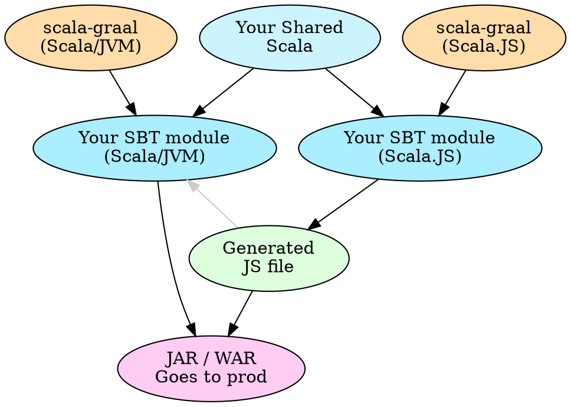

Let's say you've got a webapp with a Scala backend and a <SJR/> frontend.

You're probably serving pages like this:

```html
<html>
  <body>
    <div id="mount_my_app_here" />
    <script src="react_itself.js" />
    <script src="my_scalajs_react_app.js" />
  </body>
</html>
```

...meaning that users first load and render an empty page, then wait for the JS to fetch, parse, and finally initialise and render your app.
In other words, the user experiences a delay when they visit your site/app.

React has a feature called **"SSR", short for "server-side rendering",** which allows you to render your app on the backend and
send the resulting HTML immediately. This allows the user's experience to begin faster, because the loading of the JS and app initialisation can happen
seamlessly in the background as the reader starts reading your page. It means you start serving pages like this:

```html
<html>
  <body>
    <div id="mount_my_app_here">

      <!-- This is the initial rendering of your React component -->
      <div>
        <h1>HELLO AND WELCOME TO MY SITE!</h1>
        <p>Let me tell you all about blah blah blah...</p>
      </div>

    </div>

    <!-- Here you load React and your app as usual -->
    <script src="react_itself.js" />
    <script src="my_scalajs_react_app.js" />
  </body>
</html>
```

It's quite well documented in the JS world how you accomplish this, but what about in the Scala world?

## Step 1/5: Graal

The first thing you'll want to do is install <Graal/>.
It by Oracle and it's your normal JDK with a bunch of extra stuff that, as far as I know,
will eventually make it's way back into Java proper.
The reason we want use Graal is because of its <A href="https://www.graalvm.org/docs/reference-manual/polyglot">Polyglot support</A>.
Java's made a few attempts at being able to embed JavaScript, first with Rhino, then Nashhorn,
and now again with the Polyglot/Truffle API. Unlike previous attempts, this new approach...

1. converts JS into Truffle IR where it's able to be heavily optimised by the new Graal JIT/optimiser (i.e. successor to HotSpot)
2. it's capable of way more than just JS, and out-of-the-box it already supports R, Python, LLVM and Ruby.

If "Oracle" makes you wary due to licencing, don't worry: there are two editions of Graal available.

1. Community Edition (CE) which is completely free, and ~5% faster than the standard JVM
2. Enterprise Edition (EE) which is not free, and has more JIT optimisations giving you 5-15% better runtime performance

We'll use Graal (not just locally but as the JVM you deploy to production with your app), so that it can execute JS.
Specifically, it will execute the transpiled output of your <ScalaJS /> app.

> Note: even without embedding JS, there's a compelling reason to run your Scala with <Graal/>:
> the new JIT is significantly better at optimising Scala. <A href="https://www.graalvm.org/scala">Read mode...</A>


## Step 2/5: scala-graal

We're going to use <SG/> to help glue all of our pieces together.
What <SG/> is going to give us is:

* make calling JS from JVM nice, easy, and safe by providing a concise, Scala-friendly interface
* allow interpolation, meaning you don't have to worry about safely marshalling arguments and composing with your commands
* pre-compilation of your SSR
* huge performance increases to your SSR - either by a special type of caching (to be covered in part 2 of this article) or by JIT warmup
* helpers for SSR specifically
* we won't use them here, but there are a bunch of other features like thread-pools, async, time-limits, metrics and more
  so check that out in <A href="https://github.com/japgolly/scala-graal">scala-graal's doc</A> if you're interested.

Next let's talk about how this is going to work conceptually:



I'll assume that if you're already using <SJR/> that you're already
familiar with <ScalaJS/> cross-projects in SBT. Thus I'll simply say,
create a new cross-project in SBT that looks like this:

```scala
val scalaGraalVer = "1.0.1"

lazy val webappSsr =
  crossProject("webapp-ssr")

lazy val webappSsrJs = webappSsr.js
  .dependsOn(myScalaJsWebapp) // change this to your real SJS module name(s)
  .settings(
    libraryDependencies ++= Seq(
      "com.github.japgolly.scala-graal" %%% "core-js"       % scalaGraalVer,
      "com.github.japgolly.scala-graal" %%% "ext-boopickle" % scalaGraalVer
    ),
    scalaJSLinkerConfig ~= { _.withSourceMap(false) },
    artifactPath in (Compile, fastOptJS) := (crossTarget.value / "webapp-ssr.js"),
    artifactPath in (Compile, fullOptJS) := (crossTarget.value / "webapp-ssr.js")
  )

lazy val webappSsrJvm = webappSsr.jvm
  .settings(
    libraryDependencies ++= Seq(
      "com.github.japgolly.scala-graal" %% "core"          % scalaGraalVer,
      "com.github.japgolly.scala-graal" %% "core-js"       % scalaGraalVer,
      "com.github.japgolly.scala-graal" %% "ext-boopickle" % scalaGraalVer
    ),
    unmanagedResources in Compile += Def.taskDyn {
      val stage = (scalaJSStage in Compile in webappSsrJs).value
      val task = stageKey(stage)
      Def.task((task in Compile in webappSsrJs).value.data)
    }.value)
  )
```

This is going to give you a few things.

* `webapp-ssr/shared/src/main/scala` ← for sharing SSR code between JVM & JS
* `webapp-ssr/js/src/main/scala` ← for exposing the React components that we'll equip with SSR
* `webapp-ssr/jvm/src/main/scala` ← for performing the SSR from the JVM
* `webapp-ssr/jvm/src/main/resources/webapp-ssr.js` ← SBT will automatically populate this with the output of the `webappSsrJs` module
* Embedded JS is still JS; it doesn't speak Scala, even though you're on the JVM. You need a communication protocol.
  We'll use <BooPickle/>, a very fast binary serialisation library, to marshall data back and forth between the JVM and JS-embedded-in-the-JVM.

> Note: Whether you're enabling SSR on 1 page or 100 pages, you only need to create one SSR project.
> The pages/SPAs can (and should) live in their own SBT modules. Every time you want to equip a new component
> with SSR, you simply add it's module to the `.dependsOn(…)` list above.


## Step 3/5: Prepare the SSR JS

Firstly we'll create a little API in `webapp-ssr/shared/src/main/scala`,
to be shared between the JVM & JS modules. This will serve as the contract and protocol between both worlds.

```scala
import boopickle.Default._

object SsrSharedData {

  object Manifest {
    final val MySpa = "mySpa"
  }

  final case class MySpaInputs(name: String, age: Int)

  implicit val picklerMySpaInputs: Pickler[MySpaInputs] =
    generatePickler[MySpaInputs]
}
```

Here we're doing three things.

1. With `SsrSharedData.Manifest.MySpa`, we're declaring the name of the JS function that we'll soon export.
    Its value can be anything so long as it's unique and doesn't conflict with anything
    available in the global JS environment.
    (It has to be a `final val` so that it can be used in annotations.
    This is equivalent to the much-clearer `inline val` in Scala 3.)

2. We declare a `MySpaInputs` class to contain all the inputs/args/props to our React component.

3. We declare an implicit `Pickler[MySpaInputs]` instance so that we can serialise the data
    we need to send from the JVM to JS.

You might wonder why I'm creating a `Manifest` object with only one constant. Seems a bit wasteful.
It's because you might have more than just one page you want to equip with SSR, in which case you would
add a new entry to manifest, and (optionally) a new input class & pickler.

Next, let's expose the component we want to serve with SSR.
Create the following in `webapp-ssr/js/src/main/scala`:

```scala
import japgolly.scalagraal.Pickled
import japgolly.scalajs.react.ReactDOMServer
import scala.scalajs.js.annotation.JSExportTopLevel

/** This code is compiled into JS and executed on the JVM via Graal JS. */
object SsrJs {
  import SsrSharedData._

  @JSExportTopLevel(Manifest.MySpa)
  def mySpa(p: Pickled[MySpaInputs]): String = {
    val input = p.value // Instance of MySpaInputs
    val vdom = MyComponent(input) // replace with your real component
    ReactDOMServer.renderToString(vdom)
  }
}
```

I believe this is self-explanatory.
We take serialised input, deserialise it, pass it to our component, then
get React to render it to a string. The resulting string is the HTML that we'll
soon serve to users.


## Step 4/5: Hydrate yourself

When the frontend loads, it mounts itself into the DOM.
You'll need to now change this to "hydrate" the DOM that you rendered on the backend
and sent as part of the page HTML. Change it as follows:


```diff
   def main(args: Array[String]): Unit = {
     val container = dom.document.getElementById("root")
     val myPage = MyPageComponent(…)
-    myPage.renderIntoDOM(container)
+    ReactDOM.hydrateOrRender(myPage, container)
   }
```

We could've used `ReactDOM.hydrate` directly but I prefer to use `ReactDOM.hydrateOrRender`
because we can set it once and forget about it, regardless of whether we decide to
server-side-render it, or not. Otherwise, you'd have a code dependency where you'd have to keep
the frontend code in sync (by choosing either `render` or `hydrate`) with whatever the
backend code does.

It also allows you to make SSR conditional at runtime.
An example use case for this (which <SG/> has support for doing easily),
is to set a time limit for each server-side-render, and let the page render
without SSR if the backend cant render the page fast enough. In such a case the frontend _must_
use `ReactDOM.hydrateOrRender` as it doesn't know ahead of time what the server's going to do.


## Step 5/5: SSR in the JVM

The final step. Here we'll execute JS and React in the JVM.

We've already got our <ScalaJS/> output file on our classpath; we did that in step 2
by configuring SBT. You'll also need React itself on your classpath.
The quickest way is to just download React JS and dump it into your `webapp-ssr/jvm/src/main/resources` directory.
That's not the optimal way.
The optimal way is quite open-ended and should align with other ways you're managing JS dependencies in your project,
so I'll leave that that as an exercise to the reader.
*(In my case, I have a webpack build outside of SBT that manages all of my JS, and I have symlinks in SBT to its output.)*

Let's start by creating a file in `webapp-ssr/jvm/src/main/scala`:

```scala
import japgolly.scalagraal._
import japgolly.scalagraal.js._

object MySsr {
  import GraalBoopickle._
  import GraalJs._
  import SsrSharedData._

  val setup: Expr[Unit] =
    ReactSsr.Setup(
      Expr.requireFileOnClasspath("react.production.min.js"),
      Expr.requireFileOnClasspath("react-dom-server.browser.production.min.js"),
    ) >> Expr.requireFileOnClasspath("webapp-ssr.js").void
```

Let's break this down a bit.

* We create a `val setup`, which is a mini-program/function/procedure that we will later execute in JS.
  We don't actually execute it here, we just prepare it in the form of an `Expr[Unit]`,
  meaning it will return `Unit` when you later choose to execute it.
  This makes sense because it will statefully modify our sandbox JS environment, just like how if you
  load a JS file in a browser using `<script>` tags you don't get a return value; the JS instead
  creates global variables like `React` or `jQuery`.

* The arguments we pass to `ReactSsr.Setup` need to load React itself, and optionally,
  any other dependencies. You <u>*must not*</u> pass in your <ScalaJS/> output here.

* On the last line we have `>>` which means "and then".
  If you don't like `a >> b` you can also write it as `a.flatMap(_ => b)`.

* The last line ends in `.void` which means "discard the result and return Unit".

* Putting it all together, we load React, let `ReactSsr` from <SG/> prepare your embedded JS
  env for SSR, then we load our <ScalaJS/> output which contains our component(s).
  After executing this, your JS env will be ready to perform SSR.

Next we'll add a function (and pre-compile it) to call the endpoint we exported with
`java→@JSExportTopLevel(Manifest.MySpa)` above.

```scala
  val renderMySpa: MySpaInputs => Expr[String] =
    Expr.fn1[MySpaInputs](Manifest.MySpa).compile(_.asString)
```

* The `1` in `.fn1` means our function has one argument
* `[MySpaInputs]` indicates the type of our function input
* `Manifest.MySpa` is the name of the function we want invoked
* `.compile` means we want to pre-compile this for future/repeated use
* `_.asString` is how we process the JS function's output, and declare the return type

Pretty easy. Now we've got a function that accepts `MySpaInputs`, automatically serialises
them, calls the code that we exported above, and returns a String which is the rendered HTML.

Now that we've got everything we need, we just need to run it.
We'll start off with the easiest, but naive, method.

```scala
  def doIt(input: MySpaInputs): Expr.Result[String] = {
    val ctx = GraalContext()
    ctx.eval(setup >> renderMySpa)
  }
```

Let's unpack this.

* We're returning `Expr.Result[String]` which is an `Either[ExprError, String]`.
  There's no way of knowing your JS is going to work ahead of time --
  there could be a syntax error in one of your setup JS files,
  or your component could throw a division-by-zero error --
  you'll have to handle these errors yourself.

* We're creating a Graal "context". In order to execute your JS, you need a little stateful
  sandbox for it. When React loads, it modifies the global state to make globals like `React`
  and `ReactDOMServer` available. Calling `GraalContext()` here
  will give us our stateful sandbox.

* There are a number of different ways to create GraalContexts.
  The default `GraalContext()` is the same as `GraalContext.fixedContext()` meaning that
  a single (fixed) context will be created and reused for all `.eval` calls.
  It also means that if evaluate an expression that modifies global state, future `.eval`
  calls will be see those global modifications.
  Check out the <SG/> doc if you want an asynchronous version or different semantics.

> Note: if you're rendering an SPA, it needs to know which route to render based on the URL.
> Use `ReactSsr.setUrl` before rendering to set the URL. <br/>
> Eg. `scala→ReactSsr.setUrl("https://blah.com/login") >> renderMySpa`

So, this works! We did it!

But it does have a flaw as far as SSR is concerned.
On each request, this approach would
create a new context, spend time loading React, any dependencies, and all of your Scala.JS into it,
and then when it finally gets around to calling your component, it will do so slowly
because the Graal context / sandbox / environment is new and cold, just like cold vs hot JVMs.

That's terribly inefficient so let's fix that by replacing the last snippet with this:

```scala
  private val ctx = GraalContext()

  private lazy val init: Expr.Result[Unit] =
    ctx.eval(setup)

  def doIt(input: MySpaInputs): Expr.Result[String] =
    init.flatMap(_ => ctx.eval(renderMySpa))
```

Now we create a single context that will be initialised once,
and reused for all SSR requests. Great!!


## Performance

Now as to how fast that's going to be, it depends on how many times you call it (JIT warmup).
It's likely to be about ~100ms,
can become ~10ms after around 1000 runs,
and if you spend ~30 sec doing 10000 runs, it comes down to ~1ms (for the same inputs).
If you warm up a function by calling it repeatedly with the same inputs it becomes very fast
but unfortunately, if you then call the function with different inputs it will be slow again.
Hopefully this is something Graal will improve in future releases but if you're going to warmup
a function these days, you'd want to at least warm it up with different inputs.

The point is, the performance is volatile.
There are approaches to speed this up; <SG/> provides functionality for creating pools of contexts,
and warming up contexts which you can use on startup.

But there's an even better way. We can make this constant time (no more JIT fluctuation),
and we can make it consistently take ≤1ms. It doesn't work for all types of components,
but it does work for many. This article is long enough so stay tuned for part 2...
