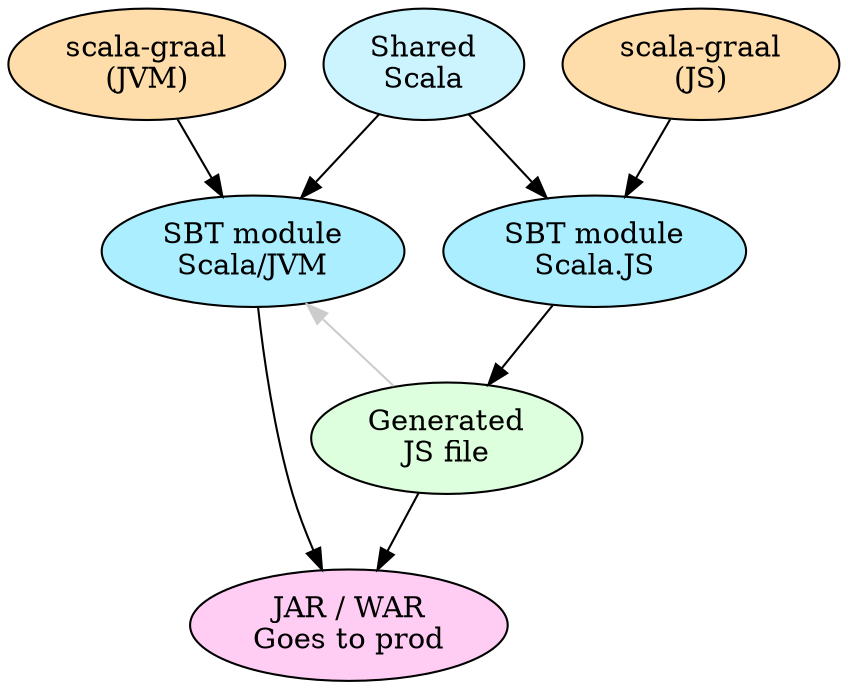

Let's say you've got a webapp with a Scala backend and a <SJR/> frontend.

You're probably serving pages like this:

```html
<html>
  <body>
    <div id="mount_my_app_here" />
    <script src="react_itself.js" />
    <script src="my_scalajs_react_app.js" />
  </body>
</html>
```

meaning that users first load and render an empty page, then wait for the JS to fetch, parse, and finally initialise and render your app.
This results in the user waiting a short while.
React has a feature called "SSR", short for "server-side rendering", which allows you to render your app on the backend and
send the resulting HTML immediately. This allows users' experience to begin faster, as the loading of the JS and app initialisation can happen
in parallel as the reader spends a few seconds reading your page. That means you start serving pages like this:

```html
<html>
  <body>
    <div id="mount_my_app_here">

      <div data-reactroot="">
        <h1>HELLO AND WELCOME TO MY SITE!</h1>
        <p>Let me tell you all about blah blah blah...</p>
      </div>

    </div>
    <script src="react_itself.js" />
    <script src="my_scalajs_react_app.js" />
  </body>
</html>
```

How to accomplish this is quite well documented in the JS world but what about in the Scala world?

## Step 1: Graal

The first thing you'll want to do is install GraalVM.
It by Oracle and it's your normal JDK with a bunch of extra stuff that I believe will
eventually make it's way back into Java proper.
The reason we want to switch to Graal is because of its Polyglot API.
Java's made a few attempts at being able to embed JavaScript, first with Rhino, then Nashhorn,
and now again with the Polyglot/Truffle API. Unlike previous attempts, this new approach...

1. converts JS into JVM bytecode or Polyglot IR, can't remember which, but whichever it is, it's able to be optimised by the new Graal optimiser (i.e. successor to HotSpot)
2. is capable of way more than just JS, and already supports R, Python, LLVM and Ruby.

If "Oracle" makes you wary due to licencing, don't worry: there are two editions of Graal available.

1. Community Edition (CE) which is completely free, and ~3% faster than the standard JVM
2. Enterprise Edition (EE) which is not free, but has more JIT optimisations giving you 5-15% better runtime performance

We'll use Graal (not just locally but as the JVM you deploy to production with your app), so that it can execute JS.
Specifically, it will execute the transpiled output of your <ScalaJS /> app.

## Step 2: scala-graal

We're going to use <SG/> to help glue all of our pieces together.
What scala-graal is going to give us is:

* make calling JS from JVM nice, easy, and safe by providing a concise, Scala-friendly interface
* allow interpolation, meaning you don't have to worry about safely marshalling arguments and composing with your commands
* precompilation of your SSR
* huge performance increases to your SSR - either by caching (I'll cover this in a sequel to this article) or by JIT warmup
* helpers for SSR specifically
* we won't use them here, but there are a bunch of other features like thread-pools, async, time-limits, metrics and more
  so check that out in <A href="https://github.com/japgolly/scala-graal">scala-graal's doc</A> if you're interested.

Next let's talk about how this is going to work conceptually:




I'll assume that if you're already using <SJR/> that you're already
familiar with cross-projects in SBT. Thus I'll simply say,
create a new cross-projects in SBT that looks like this:

```scala
val scalaGraalVer = "0.5.0"

lazy val webappSsr =
  crossProject("webapp-ssr")

lazy val webappSsrJs = webappSsr.js
  .dependsOn(myScalaJsWebapp) // change this to your real SJS module name(s)
  .settings(
    libraryDependencies ++= Seq(
      "com.github.japgolly.scala-graal" %%% "core"          % scalaGraalVer,
      "com.github.japgolly.scala-graal" %%% "ext-boopickle" % scalaGraalVer
    ),
    scalaJSLinkerConfig ~= { _.withSourceMap(false) },
    artifactPath in (Compile, fastOptJS) := (crossTarget.value / "webapp-ssr.js"),
    artifactPath in (Compile, fullOptJS) := (crossTarget.value / "webapp-ssr.js")
  )

lazy val webappSsrJvm = webappSsr.jvm
  .settings(
    libraryDependencies ++= Seq(
      "com.github.japgolly.scala-graal" %% "core"          % scalaGraalVer,
      "com.github.japgolly.scala-graal" %% "util"          % scalaGraalVer,
      "com.github.japgolly.scala-graal" %% "ext-boopickle" % scalaGraalVer
    ),
    unmanagedResources in Compile += Def.taskDyn {
      val stage = (scalaJSStage in Compile in webappSsrJs).value
      val task = stageKey(stage)
      Def.task((task in Compile in webappSsrJs).value.data)
    }.value)
  )
```

This is going to give you a few things.

* `webapp-ssr/shared/src/main/scala` ← for sharing SSR code between JVM & JS
* `webapp-ssr/js/src/main/scala` ← for exposing the React components that we'll equip with SSR
* `webapp-ssr/jvm/src/main/scala` ← for performing the SSR from the JVM
* `webapp-ssr/jvm/src/main/resources/webapp-ssr.js` ← SBT will automatically populate this with the output of the `webappSsrJs` module
* it will use <BooPickle/>, a very fast binary serialisation library, to marshall data back and forth between the JVM and JS-embedded-in-the-JVM


## Step 3: Prepare the SSR JS

Firstly we'll create a little API in `webapp-ssr/shared/src/main/scala`,
to be shared between the JVM & JS modules:

```scala
import boopickle.Default._

object SsrSharedData {

  object Manifest {
    final val MySpa = "mySpa"
  }

  final case class MySpaInputs(name: String, age: Int)

  implicit val picklerMySpaInputs: Pickler[MySpaInputs] =
    generatePickler[MySpaInputs]
}
```

Here we're doing three things.

1. We're declaring the name of the JS function that we'll soon export.
    Its value can be anything so long as it's unique and doesn't conflict with anything
    available in the global JS environment.

    It has to be a `final val` so that it can be used in annotations, which we'll do in the
    next step.

2. We declare a `MySpaInputs` class to contain all the inputs/args/props to our React component.

3. We declare an implicit `Pickler[MySpaInputs]` instance so that we can serialise the data
    we need to send from the JVM to JS.

Next, let's expose the component we want to serve with SSR.
Create the following in `webapp-ssr/js/src/main/scala`:

```scala
import japgolly.scalagraal.Pickled
import japgolly.scalajs.react.ReactDOMServer
import scala.scalajs.js.annotation.JSExportTopLevel

/** This code is compiled into JS and executed on the JVM through Graal JS. */
object SsrJs {
  import SsrSharedData._

  @JSExportTopLevel(Manifest.MySpa)
  def mySpa(p: Pickled[MySpaInputs]): String = {
    val input = p.value // Instance of MySpaInputs
    val vdom = MyComponent(input) // replace with your real component
    ReactDOMServer.renderToString(vdom)
  }
}
```

I believe this is self-explanatory.
We take serialised input, deserialise it, pass it to our component, then
get React to render it to a string. The resulting string is the HTML that we'll
soon serve to users.

## Step 4: Hydrate yourself

When the frontend loads, it mounts itself into the DOM.
You'll need to now change this to "hydrate" the DOM that you rendered on the backend
and sent as part of the page HTML. Change it as follows:


```diff
   def main(args: Array[String]): Unit = {
     val container = dom.document.getElementById("root")
     val myPage = MyPageComponent(…)
-    myPage.renderIntoDOM(container)
+    ReactDOM.hydrateOrRender(myPage, container)
   }
```

We could've used `ReactDOM.hydrate` directly but I prefer to use `ReactDOM.hydrateOrRender`
because we can set it once and forget about it, regardless of whether we decide to
server-side-render it. Otherwise, you'd have a code dependency where you'd have to keep
the frontend code in sync (by choosing either `render` or `hydrate`) with whatever the
backend code does.

It also allows you to make SSR conditional at runtime.
An example use case for this (which <SG/> has support for doing easily),
is set a time limit for each server-side-render, and let the page render
without SSR if it cant complete in it. In such a case the frontend _must_
use `ReactDOM.hydrateOrRender` as it doesn't know which it will need to do.

## Step 5: SSR in the JVM

The final step. Here we'll execute JS and React in the JVM.

We've already got our <ScalaJS/> output file on our classpath; we did that in step 2
by configuring SBT. You're also gonna need React itself on your classpath. I'll leave
that as an exercise to the reader as how you do that is quite open-ended and should align
with other ways you're managing JS in your project. The quickest way is simply just to
download React itself and dump it into your `webapp-ssr/jvm/src/main/resources` directory.

Let's start by creating a file in `webapp-ssr/jvm/src/main/scala`:

```scala
import japgolly.scalagraal._
import japgolly.scalagraal.util.ReactSsr

object MySsr {
  import GraalBoopickle._
  import GraalJs._
  import SsrSharedData._

  val setup: Expr[Unit] =
    ReactSsr.Setup(
      Expr.requireFileOnClasspath("react.production.min.js"),
      Expr.requireFileOnClasspath("react-dom-server.browser.production.min.js"),
    ) >> Expr.requireFileOnClasspath("webapp-ssr.js").void
```

Let's break this down a bit.

* We create a `setup` mini-program/function/procedure that we can execute in JS.
  We don't actually execute it here, just create it as an `Expr[Unit]`, which is
  code that will return a `Unit` when you later choose to execute it.

* The arguments we pass to `ReactSsr.Setup` need to load React itself, and optionally,
  any other dependencies. You must not pass in your <ScalaJS/> output here.

* One we last line we have `>>` which means "and then".
  This line ends in `.void` which means "discard the result and return Unit".

* Putting it all together, we load React, let `ReactSsr` from <SG/> prepare your embedded JS
  env for SSR, then we load our <ScalaJS/> output which contains our component(s).
  After executing this, your JS env will be ready to perform SSR.

Next we'll add a function (and pre-compile it) to call the endpoint we exported with
`java→@JSExportTopLevel(Manifest.MySpa)` above.

```scala
  val renderMySpa: MySpaInputs => Expr[String] =
    Expr.fn1[MySpaInputs](Manifest.MySpa).compile(_.asString)
```

Pretty easy. Now we've got a function that accepts `MySpaInputs`, automatically serialises
them, calls the code that we exported above, and returns a String which is the rendered HTML.

Now that we've got everything we need, we just need to run it.
We'll start off with the easiest, but naive, method.

```scala
  def doIt(input: MySpaInputs): Expr.Result[String] = {
    val ctx = ContextSync.newContextPerUse()
    ctx.eval(setup >> renderMySpa)
  }
```

Let's unpack this.

* We're returning `Expr.Result[String]` which is an `Either[ExprError, String]`.
  There's no way of knowing your JS is going to work ahead of time --
  there could be a syntax error in one of your setup JS files,
  or your component could throw a division-by-zero error --
  you'll have to handle these errors yourself.

* We're creating a "context". In order to execute your JS, you need a little stateful
  sandbox for it. When React loads, it modifies the global state to make globals like `React`
  and `ReactDOMServer` available. Here we're using `ContextSync.newContextPerUse`
  which will create a new context (stateful sandbox) on each call to `.eval`, and then
  discard it as soon as it's no longer needed.

* The `Sync` in `ContextSync` means we interact with the context is a synchronous manner.
  <SG/> provides asynchronous versions as well.

So, this works! But it does have a flaw as far as SSR is concerned.
On each request, this approach would
create a new context, and spend time loading React, any deps, and all of your Scala.JS into it,
and then call your component slowly because the env (just like the JVM) is cold.

That's terribly ineffeficent. Let's fix that by replacing the last snippet with this:

```scala
  private val ctx = ContextSync.fixedContext()

  private lazy val init: Expr.Result[Unit] =
    ctx.eval(setup)

  def doIt(input: MySpaInputs): Expr.Result[String] =
    init.flatMap(_ => ctx.eval(renderMySpa))
```

Now we create a single, fixed context that will be initialised once,
and reused for all future calls. Great!!

Now as to how fast that's going to be, it depends on how many times you call it (JIT warmup).
It could be ~10 ms but it's likely to be ~100ms (from memory).

There are approaches to speed this up, <SG/> provides functionality for creating context pools,
and warming up contexts which you can run on startup.

But there's an even better way. We can make this constant time (no more JIT fluctuation),
and we can make it consistent take ~0ms. It doesn't work for all types of components,
but it does work for many. This article is long enough though so stay tuned for part 2...

